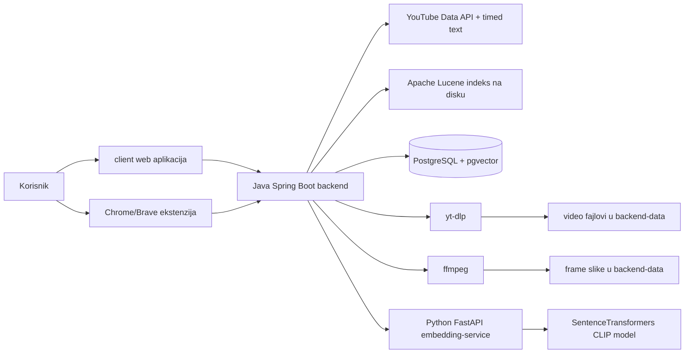
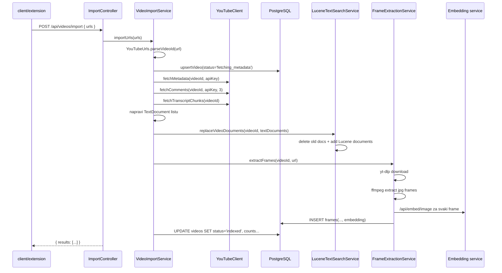
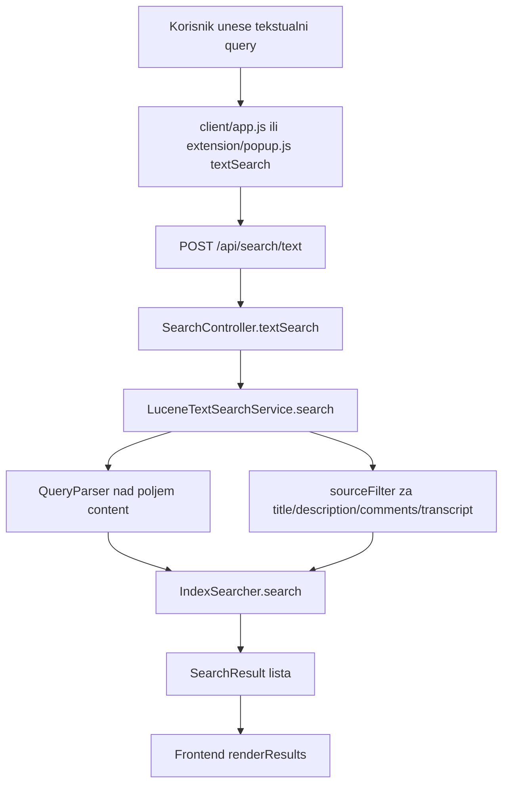
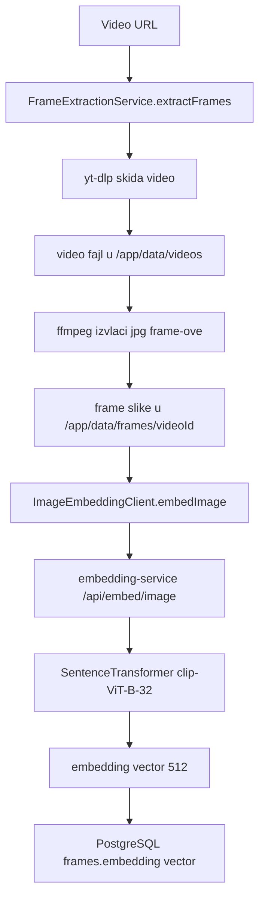
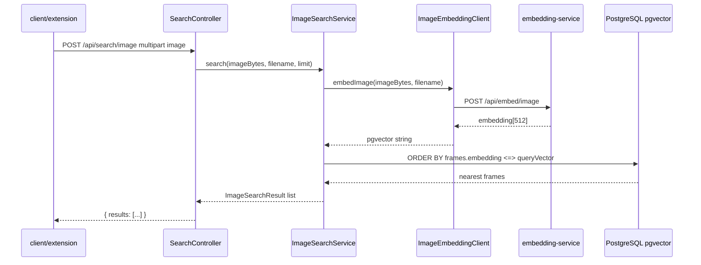
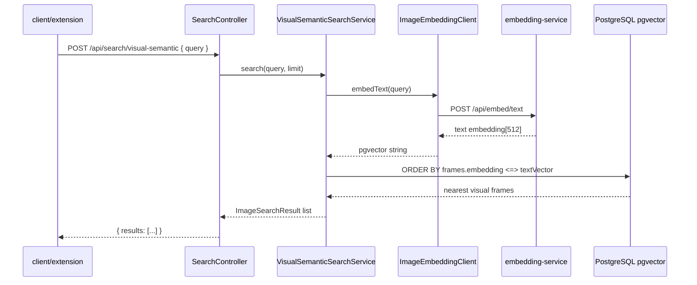
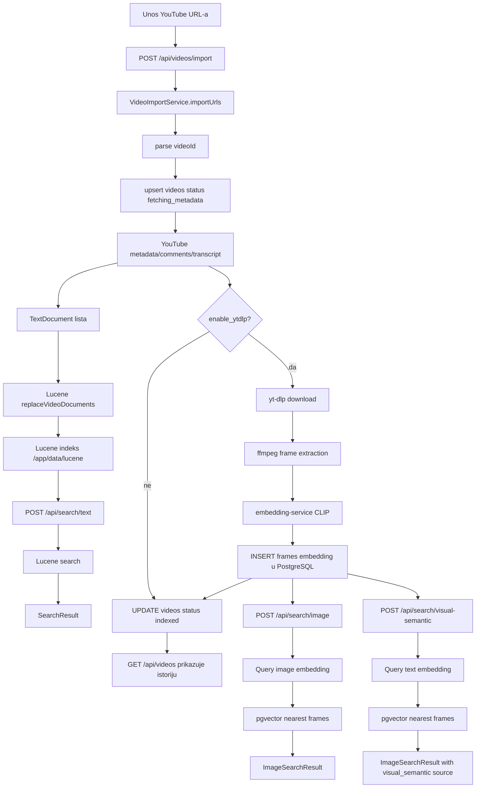

# PROJECT_FLOW - vodic kroz strukturu, alate i tok podataka

Ovaj dokument objasnjava kako je projekat organizovan, koji alati se koriste i kako podaci prolaze kroz sistem od unosa YouTube linka, preko indeksiranja, do tekstualne i vizuelne pretrage.

Cilj dokumenta je da programer moze brzo da razume projekat i da ga objasni profesoru kroz konkretne foldere, fajlove, klase, funkcije i tokove podataka.

## 1. Kratak opis sistema

Projekat je sistem za pretrazivanje YouTube video materijala.

Korisnik moze da:

- unese jedan ili vise YouTube URL-ova,
- sacuva osnovnu konfiguraciju, na primer YouTube API key i interval vadjenja frame-ova,
- indeksira video tekstualno kroz naslov, opis, komentare i transkript,
- indeksira video vizuelno kroz izdvojene frame-ove i CLIP embedding vektore,
- pretrazuje tekst preko Lucene indeksa,
- pretrazuje slikom preko pgvector slicnosti u PostgreSQL bazi.

Sistem ima dva korisnicka interfejsa:

- `client/` - samostalni web klijent,
- `extension/` - Brave/Chrome ekstenzija.

Oba interfejsa koriste isti Java backend API.

## 2. Glavni delovi arhitekture



Najvaznija ideja:

- tekstualni deo se indeksira u Apache Lucene indeksu,
- vizuelni deo se cuva kao embedding vektori u PostgreSQL bazi preko pgvector ekstenzije,
- Spring Boot backend koordinise ceo proces.

## 3. Struktura projekta

```text
backend/
  pom.xml
  Dockerfile
  src/main/java/com/aleksamitic/videosearch/
    VideoSearchApplication.java
    api/
    config/
    embedding/
    frames/
    search/
    util/
    video/
    youtube/
  src/main/resources/
    application.yml
    schema.sql

client/
  index.html
  app.js
  styles.css
  Dockerfile
  nginx.conf

extension/
  manifest.json
  popup.html
  popup.js
  popup.css
  options.html
  options.js
  options.css
  Dockerfile
  nginx.conf

embedding-service/
  Dockerfile
  requirements.txt
  app/main.py

docker-compose.yml
start.ps1
README.md
AGENTS.md
PROJECT_FLOW.md
```

## 4. Alati i biblioteke

### Backend

Backend je Java Spring Boot aplikacija u folderu `backend/`.

Glavni alati:

- Java 21,
- Spring Boot 3.3.6,
- Spring Web za REST API endpoint-e,
- Spring JDBC za rad sa PostgreSQL bazom,
- Apache Lucene 9.12.2 za tekstualno indeksiranje i pretragu,
- PostgreSQL JDBC driver,
- Maven za build.

Najvazniji backend fajlovi:

- `backend/pom.xml` - Maven konfiguracija i dependencies,
- `backend/Dockerfile` - build Java aplikacije i instalacija `ffmpeg`, `yt-dlp`,
- `backend/src/main/resources/application.yml` - port, baza, data folder, embedding URL,
- `backend/src/main/resources/schema.sql` - SQL sema za PostgreSQL i pgvector,
- `backend/src/main/java/com/aleksamitic/videosearch/VideoSearchApplication.java` - ulazna tacka Spring Boot aplikacije.

### PostgreSQL i pgvector

Baza se pokrece kroz Docker Compose preko image-a:

```text
pgvector/pgvector:pg16
```

Koristi se za:

- istoriju importovanih videa,
- runtime konfiguraciju,
- podatke o frame-ovima,
- embedding vektore frame-ova.

Najvaznije tabele su u `backend/src/main/resources/schema.sql`:

- `runtime_config`,
- `videos`,
- `frames`.

Tabela `frames` ima kolonu:

```sql
embedding vector(512)
```

To znaci da se za svaki izdvojeni frame cuva CLIP vektor dimenzije 512.

### Lucene

Lucene se koristi samo u Java backendu, za tekstualno pretrazivanje.

Indeks nije u PostgreSQL bazi. Cuva se na filesystem-u, u runtime data folderu:

```text
/app/data/lucene
```

U Docker Compose-u je taj folder deo `backend-data` Docker volume-a.

Glavna klasa:

```text
backend/src/main/java/com/aleksamitic/videosearch/search/LuceneTextSearchService.java
```

### Python embedding service

Embedding servis je izolovan u folderu:

```text
embedding-service/
```

Koristi:

- Python,
- FastAPI,
- sentence-transformers,
- model `clip-ViT-B-32`,
- PIL za ucitavanje slike,
- NumPy za konverziju embedding-a.

Glavni fajl:

```text
embedding-service/app/main.py
```

Ovaj servis ne zna nista o YouTube videima, PostgreSQL bazi ili Lucene indeksu. Njegova uloga je samo:

1. primi sliku,
2. izracuna CLIP embedding,
3. primi tekstualni opis scene/akcije,
4. izracuna CLIP text embedding,
5. vrati listu brojeva.

### yt-dlp i ffmpeg

Ovi alati se instaliraju u backend Docker image-u.

Koriste se u:

```text
backend/src/main/java/com/aleksamitic/videosearch/frames/FrameExtractionService.java
```

`yt-dlp` skida video fajl, a `ffmpeg` iz njega izvlaci slike na zadatom vremenskom intervalu.

### Docker Compose

`docker-compose.yml` je glavni runtime fajl.

Servisi su:

- `postgres`,
- `backend`,
- `embedding-service`,
- `client`,
- `extension`.

`start.ps1` pokrece:

```powershell
docker compose up --build -d
```

## 5. Backend paketi

Backend Java paket je:

```text
com.aleksamitic.videosearch
```

Unutar njega su sledeci paketi.

### `api/`

Sadrzi REST controllere. To su ulazne tacke za frontend i ekstenziju.

Fajlovi:

- `HealthController.java` - health check,
- `ConfigController.java` - citanje i izmena runtime konfiguracije,
- `VideoController.java` - lista videa i brisanje videa,
- `ImportController.java` - import YouTube URL-ova,
- `SearchController.java` - tekstualna i image pretraga,
- `FrameController.java` - vracanje izdvojene frame slike po ID-u.

### `config/`

Sadrzi konfiguraciju aplikacije.

Fajlovi:

- `AppProperties.java` - mapira `app.*` vrednosti iz `application.yml`,
- `RuntimeConfigService.java` - cita i upisuje runtime podesavanja u tabelu `runtime_config`,
- `CorsConfig.java` - dozvoljava pozive iz web klijenta i ekstenzije.

### `youtube/`

Sadrzi rad sa YouTube podacima.

Fajlovi:

- `YouTubeClient.java` - zove YouTube Data API za metadata i komentare, i timed text endpoint za transkript,
- `YouTubeMetadata.java` - record za osnovne podatke o videu,
- `TranscriptChunk.java` - record za delove transkripta sa timestamp-om.

### `video/`

Sadrzi glavni import workflow.

Fajl:

- `VideoImportService.java` - orkestrira ceo import: baza, YouTube podaci, Lucene dokumenti, frame extraction.

### `search/`

Sadrzi tekstualnu i image pretragu.

Fajlovi:

- `TextDocument.java` - interni model jednog tekstualnog dokumenta koji se indeksira u Lucene,
- `SearchResult.java` - JSON rezultat tekstualne pretrage,
- `LuceneTextSearchService.java` - indeksiranje i pretraga teksta,
- `ImageSearchService.java` - image similarity search preko pgvector,
- `VisualSemanticSearchService.java` - pretraga frame-ova prirodnim opisom scene ili akcije,
- `ImageSearchResult.java` - JSON rezultat image pretrage.

### `frames/`

Sadrzi rad sa video fajlovima i frame slikama.

Fajl:

- `FrameExtractionService.java` - skida video, izvlaci frame-ove, salje ih embedding servisu i upisuje ih u bazu.

### `embedding/`

Sadrzi Java HTTP klijent ka Python embedding servisu.

Fajl:

- `ImageEmbeddingClient.java` - salje sliku na `/api/embed/image` i pretvara rezultat u pgvector format.

### `util/`

Pomocne funkcije.

Fajl:

- `YouTubeUrls.java` - parsiranje YouTube URL-a i pravljenje YouTube timestamp URL-a.

## 6. Runtime konfiguracija

Konfiguracija ima dva nivoa.

Prvi nivo je environment/application config:

```text
backend/src/main/resources/application.yml
```

Bitna podesavanja:

```yaml
server:
  port: 8000

app:
  data-dir: ${APP_DATA_DIR:/app/data}
  youtube-api-key: ${YOUTUBE_API_KEY:}
  frame-interval-seconds: ${FRAME_INTERVAL_SECONDS:8}
  embedding-service-url: ${EMBEDDING_SERVICE_URL:http://embedding-service:8081}
```

Drugi nivo je runtime config u bazi:

```text
runtime_config
```

Klasa `RuntimeConfigService` prvo pokusava da procita vrednost iz baze. Ako vrednost ne postoji, koristi fallback iz `application.yml`.

Bitne metode:

- `youtubeApiKey()`,
- `frameIntervalSeconds()`,
- `enableYtdlp()`,
- `dataDir()`,
- `embeddingServiceUrl()`.

Frontend i ekstenzija menjaju konfiguraciju preko:

```text
GET  /api/config
POST /api/config
```

## 7. Glavni endpoint-i

| Endpoint | Metod | Klasa | Uloga |
|---|---:|---|---|
| `/api/health` | GET | `HealthController` | Provera da li backend radi |
| `/api/config` | GET | `ConfigController` | Vraca runtime config |
| `/api/config` | POST | `ConfigController` | Cuva YouTube API key, frame interval, enable_ytdlp |
| `/api/videos` | GET | `VideoController` | Lista importovanih videa |
| `/api/videos/{videoId}` | DELETE | `VideoController` | Brise video iz baze, Lucene indeksa i fajlova |
| `/api/videos/import` | POST | `ImportController` | Importuje i indeksira YouTube URL-ove |
| `/api/search/text` | POST | `SearchController` | Tekstualna pretraga preko Lucene |
| `/api/search/image` | POST | `SearchController` | Image pretraga preko CLIP embedding-a i pgvector |
| `/api/search/visual-semantic` | POST | `SearchController` | Pretraga frame-ova tekstualnim opisom scene/akcije |
| `/api/frames/{frameId}` | GET | `FrameController` | Vraca JPEG frame iz filesystem-a |

Napomena: `client/app.js` i `extension/popup.js` imaju UI funkciju za `/api/search/hybrid`, ali backend trenutno nema taj endpoint. Hybrid search je sledeci milestone, nije zavrsen u trenutnom kodu.

## 8. Tok importovanja videa

Ovo je najvazniji tok za demonstraciju.



### 8.1 Ulaz iz frontenda

U web klijentu je relevantna funkcija:

```text
client/app.js -> importVideos()
```

U ekstenziji:

```text
extension/popup.js -> importVideos()
```

Obe funkcije salju JSON:

```json
{
  "urls": [
    "https://www.youtube.com/watch?v=..."
  ]
}
```

na endpoint:

```text
POST /api/videos/import
```

### 8.2 ImportController

Fajl:

```text
backend/src/main/java/com/aleksamitic/videosearch/api/ImportController.java
```

Bitna metoda:

```java
@PostMapping("/api/videos/import")
public Map<String, Object> importVideos(@RequestBody ImportRequest request) {
    return Map.of("results", videoImportService.importUrls(request.urls() == null ? List.of() : request.urls()));
}
```

Controller ne radi indeksiranje. On samo prima HTTP request i prosledjuje listu URL-ova u `VideoImportService`.

### 8.3 VideoImportService.importUrls

Fajl:

```text
backend/src/main/java/com/aleksamitic/videosearch/video/VideoImportService.java
```

Metoda:

```java
public List<ImportResult> importUrls(List<String> urls)
```

Sta radi:

1. prolazi kroz svaki URL,
2. parsira `videoId` preko `YouTubeUrls.parseVideoId(url)`,
3. ako URL nije validan, vraca failed rezultat,
4. ako je validan, poziva privatnu metodu `importVideo(videoId, url)`,
5. ako import pukne, upisuje status `failed` u bazu.

Ovo je outer workflow metoda. Ona upravlja greskama za svaki URL posebno.

### 8.4 VideoImportService.importVideo

Ovo je centralna metoda importovanja.

Koraci:

1. `upsertVideo(videoId, url, "fetching_metadata")`

   Video se ubacuje u tabelu `videos` ili se azurira ako vec postoji.

2. `runtimeConfigService.youtubeApiKey()`

   Cita YouTube API key iz runtime konfiguracije.

3. `youTubeClient.fetchMetadata(videoId, apiKey)`

   Ucitava:

   - naslov,
   - opis,
   - thumbnail,
   - kanal,
   - trajanje.

4. `youTubeClient.fetchComments(videoId, apiKey, 3)`

   Ucitava komentare sa YouTube Data API-ja. Broj `3` znaci do 3 stranice komentara, svaka do 100 komentara.

5. `youTubeClient.fetchTranscriptChunks(videoId)`

   Pokusava da ucita transkript preko YouTube timed text endpoint-a.

6. Pravi `List<TextDocument>`.

   U Lucene ne ide jedan veliki dokument po videu, nego vise manjih dokumenata:

   - jedan za title,
   - jedan za description,
   - vise dokumenata za komentare,
   - vise dokumenata za delove transkripta.

7. `luceneTextSearchService.replaceVideoDocuments(videoId, textDocuments)`

   Stari Lucene dokumenti za taj video se brisu i zatim se upisuju novi.

8. Ako je `enable_ytdlp` ukljucen:

   ```java
   frameExtractionService.extractFrames(videoId, url)
   ```

   Tada se radi video download, frame extraction i image embedding.

9. Azurira se tabela `videos`:

   - `title`,
   - `description`,
   - `thumbnail_url`,
   - `channel_title`,
   - `duration`,
   - `status = 'indexed'`,
   - `comment_count`,
   - `transcript_count`,
   - `text_doc_count`,
   - `frame_count`.

## 9. Kako se pravi tekstualni indeks

### 9.1 TextDocument model

Fajl:

```text
backend/src/main/java/com/aleksamitic/videosearch/search/TextDocument.java
```

Record:

```java
public record TextDocument(
        String videoId,
        String sourceType,
        String sourceId,
        Integer timestampSeconds,
        String title,
        String content,
        String thumbnailUrl
) {
}
```

Znacenje polja:

| Polje | Znacenje |
|---|---|
| `videoId` | YouTube ID videa |
| `sourceType` | Odakle tekst dolazi: `metadata`, `description`, `comment`, `transcript` |
| `sourceId` | ID dela unutar izvora, na primer broj komentara ili chunk transkripta |
| `timestampSeconds` | Timestamp za transcript chunk, ako postoji |
| `title` | Naslov videa |
| `content` | Tekst koji se indeksira i pretrazuje |
| `thumbnailUrl` | Thumbnail za prikaz rezultata |

### 9.2 Kreiranje TextDocument objekata

U `VideoImportService.importVideo` se dodaju dokumenti:

```java
addDocument(textDocuments, videoId, "metadata", "title", null, metadata.title(), metadata.title(), metadata.thumbnailUrl());
addDocument(textDocuments, videoId, "description", "description", null, metadata.title(), metadata.description(), metadata.thumbnailUrl());
```

Za komentare:

```java
addDocument(textDocuments, videoId, "comment", String.valueOf(index), null, metadata.title(), comments.get(index), metadata.thumbnailUrl());
```

Za transkript:

```java
addDocument(textDocuments, videoId, "transcript", String.valueOf(index), chunk.timestampSeconds(), metadata.title(), chunk.content(), metadata.thumbnailUrl());
```

Ovo je bitno za objasnjenje IR dela: sistem ne pretrazuje samo naslov videa, nego razlicite izvore teksta, i svaki rezultat zna iz kog izvora dolazi.

### 9.3 LuceneTextSearchService.replaceVideoDocuments

Fajl:

```text
backend/src/main/java/com/aleksamitic/videosearch/search/LuceneTextSearchService.java
```

Metoda:

```java
public void replaceVideoDocuments(String videoId, List<TextDocument> documents)
```

Sta radi:

1. pravi folder za indeks ako ne postoji,
2. otvara `FSDirectory`,
3. otvara `IndexWriter`,
4. brise stare dokumente za isti `video_id`,
5. dodaje nove Lucene dokumente,
6. radi `commit()`.

Bitan deo:

```java
writer.deleteDocuments(new Term("video_id", videoId));
for (TextDocument textDocument : documents) {
    writer.addDocument(toLuceneDocument(textDocument));
}
writer.commit();
```

Ovo omogucava reimport istog videa bez dupliranja rezultata.

### 9.4 Lucene polja

Metoda:

```java
private Document toLuceneDocument(TextDocument textDocument)
```

Pravi Lucene `Document` i dodaje polja:

```java
document.add(new StringField("video_id", textDocument.videoId(), Field.Store.YES));
document.add(new StringField("source_type", textDocument.sourceType(), Field.Store.YES));
document.add(new StringField("source_id", textDocument.sourceId(), Field.Store.YES));
document.add(new StoredField("timestamp_seconds", ...));
document.add(new TextField("title", textDocument.title(), Field.Store.YES));
document.add(new TextField("content", textDocument.content(), Field.Store.YES));
document.add(new StoredField("thumbnail_url", textDocument.thumbnailUrl()));
```

Razlika izmedju tipova polja:

- `StringField` se ne tokenizuje. Koristi se za tacne filtere, na primer `video_id` i `source_type`.
- `TextField` se tokenizuje i analizira. Koristi se za tekst koji se pretrazuje, na primer `content` i `title`.
- `StoredField` se samo cuva da bi se vratio u rezultatu. Ne koristi se za pretragu.

Najbitnije polje za pretragu je:

```text
content
```

## 10. Kako radi tekstualna pretraga



### 10.1 Frontend poziv

U web klijentu:

```text
client/app.js -> textSearch()
```

U ekstenziji:

```text
extension/popup.js -> textSearch()
```

Salje se:

```json
{
  "query": "tekst za pretragu",
  "fields": ["title", "description", "comments", "transcript"],
  "limit": 20
}
```

### 10.2 SearchController.textSearch

Fajl:

```text
backend/src/main/java/com/aleksamitic/videosearch/api/SearchController.java
```

Metoda:

```java
@PostMapping("/api/search/text")
public Map<String, Object> textSearch(@RequestBody TextSearchRequest request)
```

Ona poziva:

```java
luceneTextSearchService.search(request.query(), request.fields(), request.limit() == null ? 10 : request.limit())
```

### 10.3 LuceneTextSearchService.search

Metoda:

```java
public List<SearchResult> search(String queryText, List<String> requestedFields, int limit)
```

Glavni koraci:

1. ako je query prazan, vraca praznu listu,
2. proverava da li Lucene indeks postoji,
3. otvara `DirectoryReader`,
4. pravi `IndexSearcher`,
5. pravi Lucene query nad poljem `content`,
6. dodaje filter za trazene izvore teksta,
7. uzima top rezultate,
8. pravi `SearchResult` objekte.

Bitna linija:

```java
Query contentQuery = new QueryParser("content", analyzer).parse(QueryParser.escape(queryText.trim()));
```

To znaci da se query pretrazuje nad Lucene poljem `content`.

Filter po izvoru teksta radi metoda:

```java
private Query sourceFilter(List<String> requestedFields)
```

Mapiranje je:

| UI field | Lucene `source_type` |
|---|---|
| `title` | `metadata` |
| `description` | `description` |
| `comments` ili `comment` | `comment` |
| `transcript` | `transcript` |

Rezultat sadrzi:

- `video_id`,
- `title`,
- `source_type`,
- `source_id`,
- `timestamp_seconds`,
- `snippet`,
- `full_text`,
- `score`,
- `youtube_timestamp_url`,
- `thumbnail_url`,
- `matched_terms`.

Ako rezultat dolazi iz transkripta, `youtube_timestamp_url` vodi direktno na vreme u videu.

## 11. Kako radi frame extraction i image indexing

Ovo je drugi IR deo projekta: vizuelna pretraga.



### 11.1 Kada se frame extraction pokrece

U `VideoImportService.importVideo`:

```java
if (runtimeConfigService.enableYtdlp()) {
    updateStatus(videoId, "extracting_frames");
    frameCount = frameExtractionService.extractFrames(videoId, url);
}
```

Ako je `enable_ytdlp` false, tekstualno indeksiranje i dalje radi, ali se ne rade frame-ovi. Tada image search i visual semantic search za taj video nece imati vizuelne rezultate.

### 11.2 FrameExtractionService.extractFrames

Fajl:

```text
backend/src/main/java/com/aleksamitic/videosearch/frames/FrameExtractionService.java
```

Metoda:

```java
public int extractFrames(String videoId, String url)
```

Koraci:

1. `downloadVideo(videoId, url)`

   Skida video pomocu `yt-dlp` ako vec nije skinut.

2. `framesDirectory(videoId)`

   Odredjuje folder za frame-ove:

   ```text
   /app/data/frames/{videoId}
   ```

3. `clearFrames(videoId, frameDirectory)`

   Brise stare frame-ove iz baze i filesystem-a za taj video.

4. Pokrece `ffmpeg`:

   ```text
   ffmpeg -y -i video -vf fps=1/{frameIntervalSeconds} -q:v 3 frame_%05d.jpg
   ```

   Ako je interval 8 sekundi, uzima se jedan frame na svakih 8 sekundi.

5. Za svaki `.jpg` frame:

   - racuna timestamp,
   - salje sliku embedding servisu,
   - embedding pretvara u pgvector format,
   - upisuje red u tabelu `frames`.

Upis u bazu:

```sql
INSERT INTO frames(video_id, timestamp_seconds, frame_path, embedding)
VALUES (?, ?, ?, ?::vector)
```

## 12. Kako radi embedding servis

Fajl:

```text
embedding-service/app/main.py
```

Servis je FastAPI aplikacija.

Endpoint:

```text
POST /api/embed/image
```

Prima multipart form field:

```text
image
```

Glavna funkcija:

```python
@app.post("/api/embed/image")
async def embed_image(image: UploadFile = File(...)) -> dict:
    content = await image.read()
    pil_image = Image.open(BytesIO(content)).convert("RGB")
    embedding = get_model().encode([pil_image], normalize_embeddings=True)[0]
    vector = np.asarray(embedding, dtype=np.float32).tolist()
    return {
        "embedding": vector,
        "dimensions": len(vector),
        "model": MODEL_NAME,
    }
```

Model se ucitava lazy, tek kada prvi put zatreba:

```python
def get_model() -> SentenceTransformer:
    global model
    if model is None:
        model = SentenceTransformer(MODEL_NAME)
    return model
```

Default model:

```text
clip-ViT-B-32
```

Bitno za objasnjenje: isti embedding servis se koristi za indeksiranje frame-ova, query sliku koju korisnik upload-uje i tekstualni opis scene/akcije. Zato su image embedding i text embedding u istom CLIP vektorskom prostoru i mogu da se porede.

Text endpoint:

```text
POST /api/embed/text
```

Prima JSON:

```json
{
  "text": "person writing on board"
}
```

Vraca embedding istog tipa i dimenzije kao image endpoint.

## 13. Kako radi image search



### 13.1 Frontend poziv

U web klijentu:

```text
client/app.js -> imageSearch()
```

U ekstenziji:

```text
extension/popup.js -> imageSearch()
```

Salje se multipart request:

```text
POST /api/search/image
form-data:
  image: fajl slike
  limit: 20
```

### 13.2 SearchController.imageSearch

Fajl:

```text
backend/src/main/java/com/aleksamitic/videosearch/api/SearchController.java
```

Metoda:

```java
@PostMapping("/api/search/image")
public Map<String, Object> imageSearch(
        @RequestParam("image") MultipartFile image,
        @RequestParam(value = "limit", defaultValue = "10") int limit
) throws Exception
```

Ona poziva:

```java
imageSearchService.search(image.getBytes(), image.getOriginalFilename(), limit)
```

### 13.3 ImageSearchService.search

Fajl:

```text
backend/src/main/java/com/aleksamitic/videosearch/search/ImageSearchService.java
```

Metoda:

```java
public List<ImageSearchResult> search(byte[] imageBytes, String filename, int limit)
```

Koraci:

1. salje query sliku embedding servisu,
2. dobija embedding,
3. pretvara ga u pgvector string,
4. radi SQL pretragu po kosinusnoj udaljenosti,
5. vraca najblize frame-ove.

Najvazniji SQL:

```sql
SELECT f.id, f.video_id, f.timestamp_seconds, v.title, v.thumbnail_url,
       (f.embedding <=> ?::vector) AS distance
FROM frames f
JOIN videos v ON v.video_id = f.video_id
WHERE f.embedding IS NOT NULL
ORDER BY f.embedding <=> ?::vector
LIMIT ?
```

Operator:

```text
<=>
```

je pgvector operator za cosine distance kada se koristi sa `vector_cosine_ops` indeksom.

Score se racuna ovako:

```java
double score = 1.0 / (1.0 + distance);
```

Manja distance znaci slicniji frame. Score se pretvara u vrednost gde veci broj izgleda kao bolji rezultat.

## 14. Kako radi visual semantic search

Visual semantic search odgovara na pitanje "sta se desava u videu" kroz prirodni opis scene ili akcije.

Primeri query-ja:

- `person writing on board`,
- `car driving on road`,
- `lecture slide with diagram`,
- `person cooking food`,
- `computer screen with code`.

Ovo nije Lucene search i ne pretrazuje transkript, komentare ili opis. Query tekst se pretvara u CLIP text embedding, a zatim se poredi sa image embedding-ima frame-ova koji su vec sacuvani u PostgreSQL bazi.



### 14.1 Backend endpoint

Endpoint:

```text
POST /api/search/visual-semantic
```

Request:

```json
{
  "query": "person writing on board",
  "limit": 20
}
```

Klasa:

```text
backend/src/main/java/com/aleksamitic/videosearch/api/SearchController.java
```

Metoda:

```java
@PostMapping("/api/search/visual-semantic")
public Map<String, Object> visualSemanticSearch(@RequestBody VisualSemanticSearchRequest request)
```

### 14.2 VisualSemanticSearchService

Fajl:

```text
backend/src/main/java/com/aleksamitic/videosearch/search/VisualSemanticSearchService.java
```

Metoda:

```java
public List<ImageSearchResult> search(String query, int limit)
```

Koraci:

1. proverava da query nije prazan,
2. poziva `imageEmbeddingClient.embedText(query)`,
3. pretvara embedding u pgvector string,
4. radi `ORDER BY f.embedding <=> ?::vector`,
5. vraca frame-ove i YouTube timestamp URL.

Zato je za ovaj feature potrebno da je video prethodno importovan sa ukljucenim frame extraction-om. Ako video nema frame embedding-e, semantic search nema nad cim da radi.

## 15. Baza podataka

Sema je u:

```text
backend/src/main/resources/schema.sql
```

### `runtime_config`

Cuva konfiguraciju koju korisnik moze da menja iz UI-ja.

Polja:

- `key`,
- `value`,
- `updated_at`.

Primeri kljuceva:

- `youtube_api_key`,
- `frame_interval_seconds`,
- `enable_ytdlp`.

### `videos`

Cuva osnovne podatke o importovanom videu.

Bitna polja:

- `video_id` - primarni kljuc,
- `url`,
- `title`,
- `description`,
- `thumbnail_url`,
- `channel_title`,
- `duration`,
- `status`,
- `error`,
- `comment_count`,
- `transcript_count`,
- `frame_count`,
- `text_doc_count`,
- `created_at`,
- `updated_at`.

Status moze da bude:

- `fetching_metadata`,
- `extracting_frames`,
- `indexed`,
- `failed`.

### `frames`

Cuva izdvojene frame-ove i njihove embedding vektore.

Bitna polja:

- `id`,
- `video_id`,
- `timestamp_seconds`,
- `frame_path`,
- `embedding vector(512)`,
- `created_at`.

Ima index:

```sql
CREATE INDEX IF NOT EXISTS idx_frames_embedding ON frames USING hnsw (embedding vector_cosine_ops);
```

To je vektorski indeks koji ubrzava similarity search.

## 16. Gde se cuvaju podaci

U Docker runtime-u backend koristi:

```text
/app/data
```

Taj folder je Docker volume:

```text
backend-data
```

Unutra se ocekuje:

```text
/app/data/lucene
/app/data/videos
/app/data/frames/{videoId}
```

Znacenje:

- `/app/data/lucene` - Apache Lucene indeks,
- `/app/data/videos` - skinuti video fajlovi,
- `/app/data/frames/{videoId}` - JPG frame-ovi za konkretan video.

PostgreSQL podaci su u posebnom Docker volume-u:

```text
postgres-data
```

Model cache za sentence-transformers je u:

```text
embedding-cache
```

Ovo ne treba commitovati u git.

## 17. Brisanje videa

Endpoint:

```text
DELETE /api/videos/{videoId}
```

Klasa:

```text
VideoController.java
```

Metoda:

```java
public Map<String, Object> deleteVideo(@PathVariable String videoId)
```

Sta brise:

1. red iz tabele `videos`,
2. zbog `ON DELETE CASCADE`, brisu se i `frames` redovi,
3. `luceneTextSearchService.deleteVideo(videoId)` brise tekstualne Lucene dokumente,
4. `frameExtractionService.deleteVideoMedia(videoId)` brise video fajl i frame slike sa diska.

Ovo je kompletno brisanje iz sistema.

## 18. Frontend i ekstenzija

### Web client

Folder:

```text
client/
```

Bitni fajlovi:

- `index.html` - struktura stranice,
- `app.js` - sva logika za API pozive i renderovanje,
- `styles.css` - stilovi,
- `Dockerfile` i `nginx.conf` - serviranje statickih fajlova.

Bitne funkcije u `client/app.js`:

- `checkBackend()` - proverava `/api/health`,
- `loadBackendConfig()` - cita `/api/config`,
- `saveConfig()` - cuva `/api/config`,
- `refreshVideos()` - cita `/api/videos`,
- `importVideos()` - salje `/api/videos/import`,
- `textSearch()` - salje `/api/search/text`,
- `imageSearch()` - salje `/api/search/image`,
- `semanticSearch()` - salje `/api/search/visual-semantic`,
- `renderVideos()` - prikazuje listu videa,
- `renderResults()` - prikazuje rezultate pretrage.

### Extension

Folder:

```text
extension/
```

Bitni fajlovi:

- `manifest.json` - Chrome/Brave manifest,
- `popup.html`,
- `popup.js`,
- `popup.css`,
- `options.html`,
- `options.js`,
- `options.css`.

`popup.js` je vrlo slican `client/app.js`, samo koristi Chrome extension API za cuvanje backend URL-a:

```javaScript
chrome.storage.sync.get(["backendUrl"])
chrome.storage.sync.set({ backendUrl })
```

`options.js` sluzi da se podesi backend URL, YouTube API key, frame interval i `enable_ytdlp`.

## 19. Kompletan tok od importovanja do pretrage



## 20. Sta pokazati profesoru u kodu

Ovo su dobri fajlovi za demonstraciju jer pokazuju najvaznije koncepte.

### 1. Docker arhitektura

Fajl:

```text
docker-compose.yml
```

Pokazati servise:

- `postgres`,
- `backend`,
- `embedding-service`,
- `client`,
- `extension`.

Objasniti da Docker Compose pokrece ceo sistem i da nema rucnog Python backend-a.

### 2. Import endpoint

Fajl:

```text
backend/src/main/java/com/aleksamitic/videosearch/api/ImportController.java
```

Pokazati:

```java
@PostMapping("/api/videos/import")
```

Objasniti da frontend samo salje URL-ove, a backend radi sav posao.

### 3. Glavni import workflow

Fajl:

```text
backend/src/main/java/com/aleksamitic/videosearch/video/VideoImportService.java
```

Pokazati:

- `importUrls`,
- `importVideo`,
- `addDocument`,
- `upsertVideo`,
- `markFailed`.

Ovo je najbolji fajl za objasnjenje kako sistem prelazi iz YouTube URL-a u indeksirane podatke.

### 4. Lucene indexing

Fajl:

```text
backend/src/main/java/com/aleksamitic/videosearch/search/LuceneTextSearchService.java
```

Pokazati:

- `replaceVideoDocuments`,
- `toLuceneDocument`,
- `search`,
- `sourceFilter`.

Posebno naglasiti:

- `TextField("content", ...)` je polje koje se pretrazuje,
- `StringField("source_type", ...)` se koristi za filter,
- `IndexWriter` upisuje indeks,
- `IndexSearcher` cita indeks.

### 5. YouTube podaci

Fajl:

```text
backend/src/main/java/com/aleksamitic/videosearch/youtube/YouTubeClient.java
```

Pokazati:

- `fetchMetadata`,
- `fetchComments`,
- `fetchTranscriptChunks`.

Objasniti da metadata i komentari koriste YouTube Data API, a transkript ide preko YouTube timed text endpoint-a i zato je best-effort.

### 6. Frame extraction

Fajl:

```text
backend/src/main/java/com/aleksamitic/videosearch/frames/FrameExtractionService.java
```

Pokazati:

- `extractFrames`,
- `downloadVideo`,
- `runCommand`,
- SQL insert u tabelu `frames`.

Objasniti da backend kontrolise `yt-dlp` i `ffmpeg` kroz `ProcessBuilder`.

### 7. Embedding servis

Fajl:

```text
embedding-service/app/main.py
```

Pokazati:

- `MODEL_NAME`,
- `get_model`,
- `/api/embed/image`,
- `/api/embed/text`.

Objasniti da je ovo odvojen Python servis zato sto su ML biblioteke i model lakse izolovani van Java backend-a.

### 8. Image search

Fajl:

```text
backend/src/main/java/com/aleksamitic/videosearch/search/ImageSearchService.java
```

Pokazati SQL:

```sql
ORDER BY f.embedding <=> ?::vector
```

Objasniti da je to similarity search nad embedding vektorima.

### 9. Visual semantic search

Fajl:

```text
backend/src/main/java/com/aleksamitic/videosearch/search/VisualSemanticSearchService.java
```

Pokazati:

- `imageEmbeddingClient.embedText(query)`,
- isti pgvector `ORDER BY f.embedding <=> ?::vector`,
- `source_type = visual_semantic` u rezultatu.

Objasniti da korisnik ne upload-uje sliku, nego opis scene ili akcije. CLIP pretvara tekst u vektor koji se poredi sa frame image vektorima.

### 10. Database schema

Fajl:

```text
backend/src/main/resources/schema.sql
```

Pokazati:

- `CREATE EXTENSION IF NOT EXISTS vector;`,
- `videos`,
- `frames`,
- `embedding vector(512)`,
- HNSW indeks.

## 21. Kako objasniti projekat ukratko

Kratka verzija za prezentaciju:

> Projekat indeksira YouTube video tekstualno i vizuelno. Tekstualni podaci kao sto su naslov, opis, komentari i transkript pretvaraju se u Lucene dokumente i cuvaju se u Lucene indeksu. Vizuelni deo videa se obradjuje tako sto backend skine video preko yt-dlp, izvuce frame-ove preko ffmpeg-a, posalje svaki frame Python embedding servisu koji koristi CLIP model, i zatim cuva vektore u PostgreSQL bazi preko pgvector ekstenzije. Tekstualna pretraga ide kroz Lucene, image pretraga poredi uploadovanu sliku sa frame embedding-ovima, a visual semantic pretraga pretvara tekstualni opis scene u CLIP embedding i poredi ga sa istim frame embedding-ovima.

## 22. Sta je trenutno implementirano, a sta nije

Implementirano:

- Docker Compose runtime,
- Java Spring Boot backend,
- PostgreSQL + pgvector sema,
- runtime config API,
- video history API,
- YouTube metadata/comment import,
- best-effort transcript import,
- Lucene tekstualno indeksiranje,
- Lucene tekstualna pretraga,
- frame extraction preko `yt-dlp` i `ffmpeg`,
- Python embedding servis,
- cuvanje frame embedding-a u PostgreSQL,
- image search preko pgvector,
- visual semantic search preko CLIP text embedding-a i pgvector,
- web client,
- Chrome/Brave ekstenzija.

Nije jos implementirano u backendu:

- `/api/search/hybrid`.

Frontend i ekstenzija vec imaju UI za hybrid search, ali backend kontroler trenutno ima samo:

- `/api/search/text`,
- `/api/search/image`,
- `/api/search/visual-semantic`.

Zato hybrid search treba predstaviti kao sledeci korak, osim ako se naknadno implementira.

## 23. Mentalni model sistema

Najlakse je sistem pamtiti kroz tri sloja:

1. UI sloj

   `client/` i `extension/` samo salju HTTP request-e i prikazuju rezultate.

2. Orkestracioni sloj

   Java Spring Boot backend prima request, poziva YouTube, Lucene, bazu, `yt-dlp`, `ffmpeg` i embedding servis.

3. IR storage sloj

   - Lucene cuva tekstualni indeks,
   - PostgreSQL cuva video istoriju, config i frame embedding-e,
   - filesystem cuva video fajlove, frame slike i Lucene indeks,
   - embedding servis racuna vektore, ali ih ne cuva.

Ako treba objasniti jedan najvazniji fajl za ceo tok, to je:

```text
backend/src/main/java/com/aleksamitic/videosearch/video/VideoImportService.java
```

Ako treba objasniti informacijsko pretrazivanje, najvazniji fajlovi su:

```text
backend/src/main/java/com/aleksamitic/videosearch/search/LuceneTextSearchService.java
backend/src/main/java/com/aleksamitic/videosearch/search/ImageSearchService.java
embedding-service/app/main.py
backend/src/main/resources/schema.sql
```
